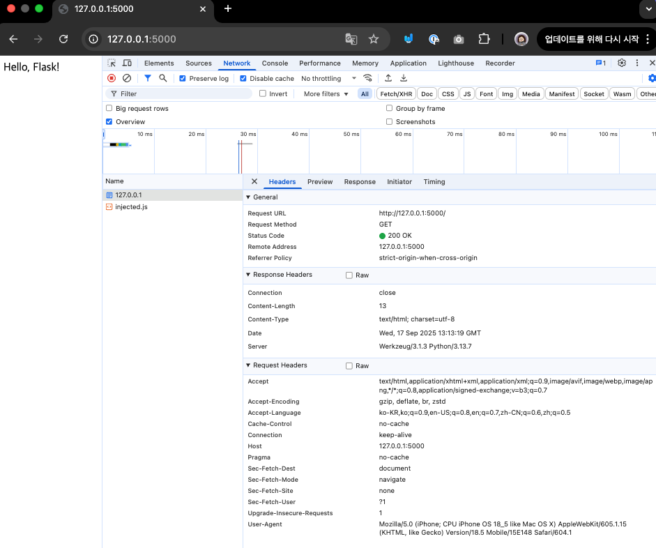

# 1일차 [실습 2]: HTTP 요청 직접 보내보기

- **[필수]** 실습 1의 코드를 실행시킵니다.
  ```bash
  cd 251219 (Day 1)/실습1
  python main.py
  ```

- 브라우저에서 직접 URL을 입력하세요: http://127.0.0.1:5000
  - 개발자 도구 -> Network 탭 -> 요청/응답을 확인해보세요.
    - 맥북: option + command + I
    - 윈도우: F12
  

- cURL을 사용해보세요
  ```bash
  curl http://127.0.0.1:5000 # Hello, Flask!
  ```